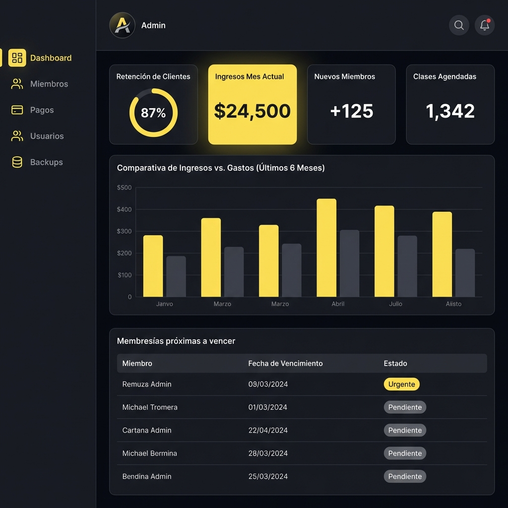

# Sistema de Gestión de Gimnasio

Este proyecto es una solución integral para la administración de gimnasios, que abarca desde el control de socios y pagos hasta un robusto sistema de copias de seguridad. Es una aplicación **Full Stack** moderna construida con tecnologías de vanguardia.

### Vistas Previas del Sistema

| Inicio de Sesión | Panel Administrativo |
| :---: | :---: |
|  |  |

---

## Arquitectura del Proyecto

El sistema está dividido en tres capas principales:

1.  **Backend (API):** Servidor RESTful encargado de la lógica de negocio y persistencia.
2.  **Frontend (UI):** Interfaz de usuario interactiva y responsiva.
3.  **Base de Datos:** Estructura relacional para el almacenamiento seguro de la información.

---

## Backend: Gym Management API

Ubicado en la carpeta `gym_api/`, es el núcleo del sistema.

### Stack Tecnológico
*   **Lenguaje:** Python 3.10+
*   **Framework:** Flask
*   **ORM:** SQLAlchemy (para manejo de base de datos)
*   **Seguridad:** JSON Web Tokens (JWT) para autenticación y autorización por roles.

### Módulos Principales
*   **Autenticación (`/api/auth`):** Inicio de sesión seguro con protección de rutas.
*   **Miembros (`/api/miembros`):** Gestión completa de socios, incluyendo seguimiento de peso, estatura y estado físico.
*   **Pagos (`/api/pagos`):** Registro de ingresos, métodos de pago y consulta de historial.
*   **Sistema de Backups (`/api/backups`):** Sistema experto para la creación de copias de seguridad (Full, Incremental, Diferencial) con monitoreo de progreso y notificaciones SMTP.

---

## Frontend: Interfaz de Usuario

Ubicado en la carpeta `frontend/`, ofrece una experiencia de usuario fluida y moderna.

### Stack Tecnológico
*   **Framework:** React 19
*   **Navegación:** React Router 7
*   **Estilos:** CSS Vanilla (enfocado en alto rendimiento y diseño personalizado).
*   **Feedback Visual:** SweetAlert2 para alertas interactivas.

### Características
*   **Dashboard Administrativo:** Visualización rápida de métricas clave.
*   **Gestión de Socios:** Interfaz para administrar la lista de miembros de forma intuitiva.
*   **Control de Pagos:** Formulario dedicado para el registro de transacciones.
*   **Configuración de Sistema:** Panel administrativo para gestionar respaldos y salud del sistema.

---

## Base de Datos

El sistema utiliza un esquema relacional optimizado.
*   **Esquema:** El archivo `db.sql` contiene la estructura de tablas para usuarios, miembros, pagos, planes y roles.
*   **Población de datos:** Dispones de `poblar_gym.py` para generar datos de prueba automáticamente y facilitar el desarrollo.

---

## Referencia de la API

Todos los endpoints (excepto health y login) requieren el encabezado:
`Authorization: Bearer <access_token>`

### Autenticación
Ubicación: `app/auth/routes.py`

#### Iniciar Sesión
*   **Endpoint:** `POST /api/auth/login`
*   **Cuerpo (JSON):**
    ```json
    {
      "email": "admin@gym.com",
      "password": "password123"
    }
    ```
*   **Respuesta (200 OK):**
    ```json
    {
      "access_token": "eyJhbGci...",
      "user": {
        "id": 1,
        "nombre": "Administrador",
        "email": "admin@gym.com",
        "role": "admin"
      }
    }
    ```

### Gestión de Miembros
Ubicación: `app/routes/miembros.py`

#### Listar Miembros
*   **Endpoint:** `GET /api/miembros`
*   **Query Params:** `page` (int, default: 1), `inactivos` (bool, default: false).
*   **Respuesta (200 OK):**
    ```json
    {
      "miembros": [
        {
          "id_miembro": 1,
          "id_usuario": 5,
          "telefono": "555-1234",
          "sexo": "M",
          "peso_inicial": 75.0,
          "estatura": 1.70,
          "estado": "Activo",
          "fecha_registro": "2024-01-31"
        }
      ],
      "total": 50,
      "pages": 9,
      "current_page": 1
    }
    ```

#### Crear Miembro
*   **Endpoint:** `POST /api/miembros`
*   **Cuerpo (JSON):**
    ```json
    {
      "id_usuario": 10,
      "telefono": "555-9876",
      "fecha_nacimiento": "1995-05-20",
      "sexo": "F",
      "peso_inicial": 60.5,
      "estatura": 1.65,
      "fecha_registro": "2024-01-31"
    }
    ```

#### Reactivar Miembro
*   **Endpoint:** `PUT /api/miembros/<id>/reactivar`
*   **Respuesta:** `{"message": "Miembro reactivado exitosamente"}`

#### Eliminar Miembro (Lógico)
*   **Endpoint:** `DELETE /api/miembros/<id>`
*   **Respuesta:** `{"message": "Miembro desactivado"}`

### Gestión de Pagos
Ubicación: `app/routes/pagos.py`

#### Registrar Pago
*   **Endpoint:** `POST /api/pagos`
*   **Cuerpo (JSON):**
    ```json
    {
      "id_miembro": 1,
      "id_membresia": 2,
      "metodo_pago": "Tarjeta",
      "numero_tarjeta": "4532..." 
    }
    ```
*   **Nota:** Si el método es "Tarjeta", se valida mediante el algoritmo de Luhn.

#### Listar Pagos
*   **Endpoint:** `GET /api/pagos`
*   **Query Params:** `page` (int, default: 1).

### Sistema de Backups
Ubicación: `app/backups/routes.py`

#### Estado del Backup
*   **Endpoint:** `GET /api/backups/status`
*   **Respuesta (200 OK):**
    ```json
    {
      "is_running": false,
      "progress_percentage": 100,
      "current_step": "Finalizado",
      "last_backup": "2024-01-31T15:00:00",
      "files": {
        "full": "/api/backups/download/backup_full_..."
      }
    }
    ```

#### Iniciar Backup Manual
*   **Endpoint:** `POST /api/backups/trigger`
*   **Cuerpo (JSON):** `{"type": "full"}` (Opciones: `full`, `incremental`, `differential`)

#### Restaurar Backup
*   **Endpoint:** `POST /api/backups/restore`
*   **Cuerpo (JSON):** `{"filename": "nombre_archivo.sql"}`

---

## Instalación y Configuración

### Requisitos Previos
*   Python 3.10+
*   Node.js & npm
*   Servidor MySQL / MariaDB

### Configuración del Backend
1. Ir a la carpeta `gym_api`.
2. Crear un entorno virtual: `python -m venv venv`.
3. Activar el entorno: `.\venv\Scripts\activate` (Windows).
4. Instalar dependencias: `pip install -r requirements.txt`.
5. Configurar el archivo `.env` con tus credenciales de base de datos y SMTP.
6. Ejecutar: `python run.py`.

### Configuración del Frontend
1. Ir a la carpeta `frontend`.
2. Instalar dependencias: `npm install`.
3. Iniciar el servidor de desarrollo: `npm start`.

---

## Herramientas de Desarrollo
*   **Diagrama Relacional:** Consulta `Diagrama Relacional.png` para entender los vínculos entre tablas.
*   **Diagrama Entidad-Relación:** Localizado en `Diagrama entidad relacion.png`.

---

## Licencia
Proyecto de uso académico / interno. Adaptable para entornos de producción bajo configuración adecuada.

